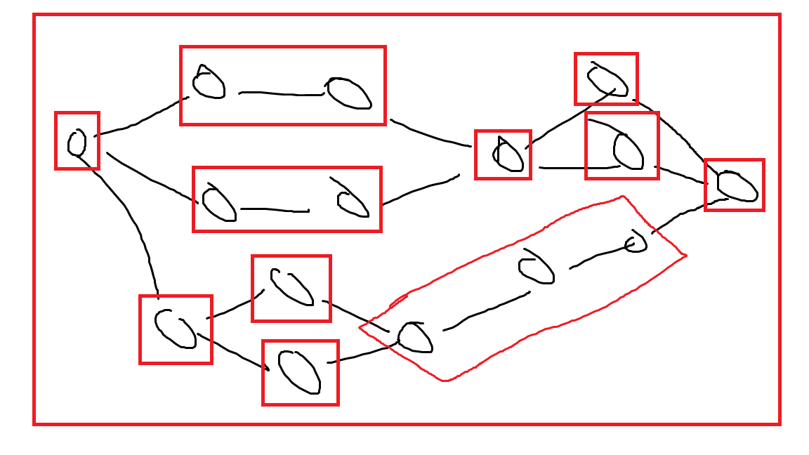

# zmq-xml-thread-poc

---

This repository contains a proof-of-concept implementation for a piece of
software that takes an XML definition (XSD schema available) of a fan in/fan out
message pipeline (directed graph) and then generates an optimised queueing
solution using ZeroMQ.

Optimisation is such that for each message node within the graph, if the node
is fanned in or fans out from multiple other nodes, a new thread is spawned with
a separate message queue for the connection between the nodes. If any node has
exactly one outgoing connection, and that other node only has exactly one
incoming connection, then no thread will be spawned on the connection boundary,
and the message will be examined by the first node and passed directly to the
second without involving ZeroMQ.

